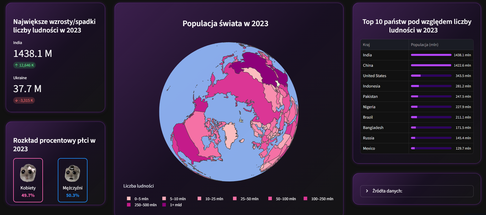
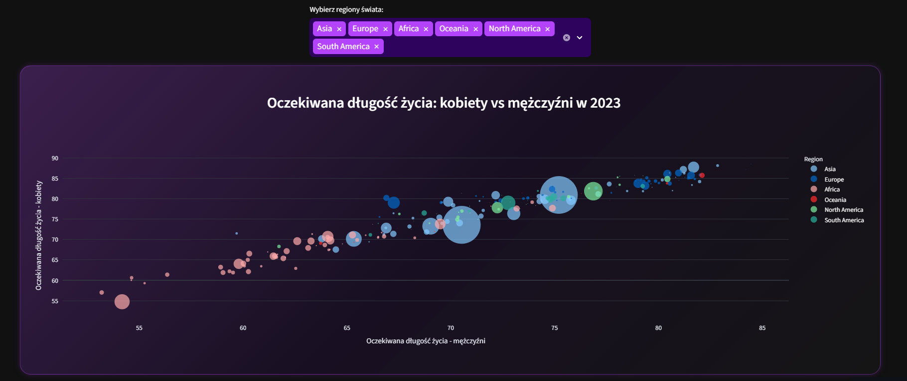

# Ludność - dashboard

## Opis projektu
Projekt polegał na stworzeniu interaktywnego dashboardu z użyciem biblioteki Streamlit. Pozwala ona na tworzenie aplikacji, które można w łatwy spoósb udostępniać przy użyciu linku. Aplikacja pozwala na filtrowanie danych, przegląd metryk oraz generowanie wykresów.

## Link do aplikacji  
[https://people-dashboard.streamlit.app/](https://people-dashboard.streamlit.app/)

## Użyte technologie
- Python
- Streamlit
- Pandas
- Plotly
- Seaborn

## Struktura projektu
```text
people-dashboard/
│
├── 🏠︎Strona_główna.py  # główny plik aplikacji
├── data/               # dane 
├── assets/             # obrazy i grafiki
├── requirements.txt    # biblioteki
└── README.md
```



